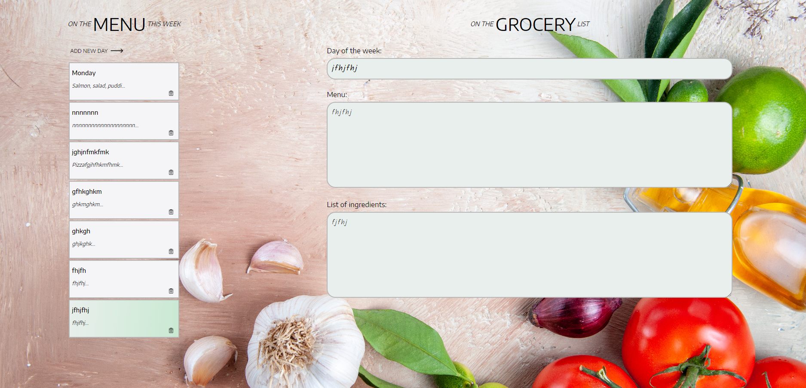

# Menu Planner App

A **simple and intuitive web app** for planning meals for each day of the week, allowing users to add, update, and remove meals and ingredients. The app stores meal plans locally using `localStorage` to ensure meal data persists across sessions.

## Features

- **Add New Meals**: Quickly add meals with a unique title, day of the week, and ingredients.
- **Edit Meals**: Update or modify existing meals and ingredients.
- **Delete Meals**: Easily remove meals from the plan.
- **Responsive Design**: The app is optimized for mobile, tablet, and desktop using **Flexbox** and **media queries** for seamless viewing across devices.
- **LocalStorage Integration**: All meal data is saved in the browser’s `localStorage`, so meal plans persist even after page refreshes.

## 🚀 Demo

Try out the application here: [https://menu-planner-serenityscript.netlify.app/](https://menu-planner-serenityscript.netlify.app/)

[](https://menu-planner-serenityscript.netlify.app/)


## Installation

To run the app locally, follow these steps:

### Prerequisites

- [Node.js](https://nodejs.org/) (>= 14.x)
- [npm](https://www.npmjs.com/) or [yarn](https://yarnpkg.com/)

### Steps

1. **Clone the repository**:
    ```bash
    git clone https://github.com/SerenityScript/menu-planner.git
    cd meal-planner-app
    ```

2. **Install dependencies**:
    ```bash
    npm install
    ```
    or
    ```bash
    yarn install
    ```

3. **Start the development server**:
    ```bash
    npm start
    ```
    or
    ```bash
    yarn start
    ```

4. Open the app in your browser at `http://localhost:3000`.

## Usage

1. **Add a new meal**: Click the "Add Meal" button to create a new meal entry.
2. **Select a day**: Click on any meal from the list to view or edit its details.
3. **Edit meal details**: Modify the meal name, day, or ingredients, then click "Save".
4. **Delete a meal**: Remove meals by clicking the "Delete" button next to the meal in the list.

## Responsive Design

The app uses **Flexbox** for layout and **media queries** for responsiveness, ensuring the app works across different screen sizes, from mobile phones to desktop monitors.

## Built With

- **React.js**: Frontend library for building the user interface.
- **uuid**: For generating unique meal IDs.
- **CSS**: For styling and responsive design.
- **localStorage**: To persist data across sessions.

## Contributing

Contributions are welcome! To contribute:

1. Fork this repository.
2. Create a new branch with your feature or fix: `git checkout -b my-feature`.
3. Commit your changes: `git commit -m 'Add new feature'`.
4. Push to the branch: `git push origin my-feature`.
5. Submit a pull request.

## License

This project is licensed under the MIT License - see the [LICENSE](LICENSE) file for details.

## Contact

If you have any questions, feel free to reach out:

- **GitHub**: [SerenityScript](https://github.com/SerenityScript)
- **Email**: [siebrandt.dev@gmail.com](mailto:siebrandt.dev@gmail.com)